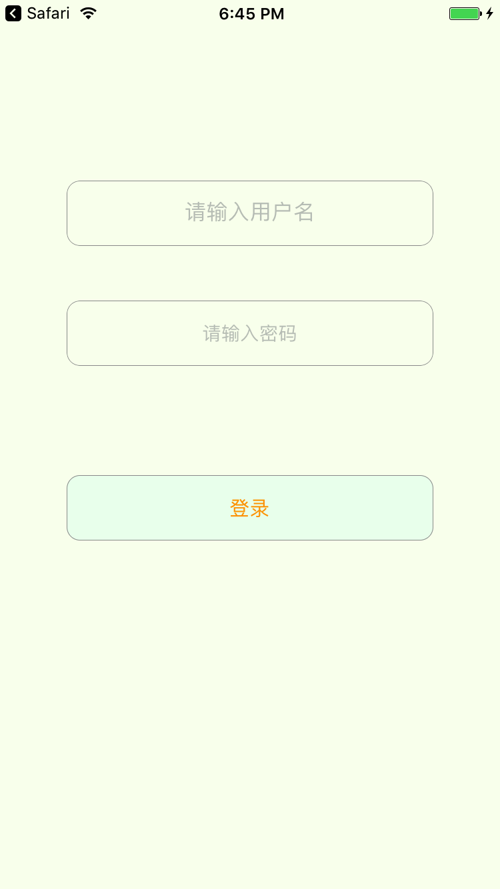

#登录页等比例缩放


---
想让这个界面上的两个输入框和一个按钮，跟随屏幕大小等比例变化。
* 设置：Autoresizing width height
* 不设置：Autoresizing top right bottom left

代码表述：

```
 view.autoresizingMask = [UIViewAutoresizing.flexibleWidth,UIViewAutoresizing.flexibleHeight]

```

密码喵是用storyboard设置的


